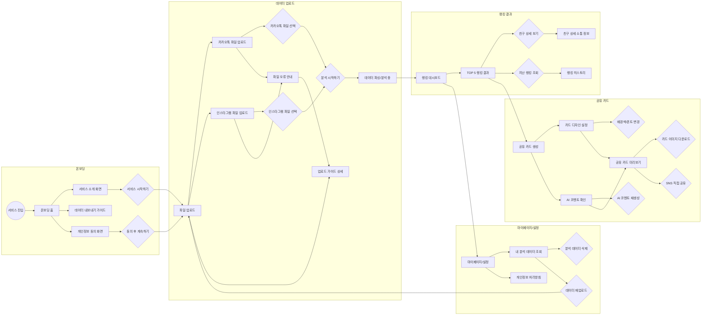

```mermaid
flowchart LR

  subgraph s1 ["온보딩"]
    n1(("서비스 진입"))
    n2["온보딩 홈"]
    n3["서비스 소개 화면"]
    n4["데이터 내보내기 가이드"]
    n5["개인정보 동의 화면"]
    n6{"서비스 시작하기"}
    n7{"동의 후 계속하기"}
  end

  subgraph s2 ["데이터 업로드"]
    n8["파일 업로드"]
    n9["카카오톡 파일 업로드"]
    n10["인스타그램 파일 업로드"]
    n11["업로드 가이드 상세"]
    n12["파일 오류 안내"]
    n13{"카카오톡 파일 선택"}
    n14{"인스타그램 파일 선택"}
    n15{"분석 시작하기"}
    n16["데이터 파싱/분석 중"]
  end

  subgraph s3 ["랭킹 결과"]
    n17["랭킹 대시보드"]
    n18["TOP 5 랭킹 결과"]
    n19["친구 상세 소통 정보"]
    n20["랭킹 히스토리"]
    n21{"친구 상세 보기"}
    n22{"지난 랭킹 조회"}
  end

  subgraph s4 ["공유 카드"]
    n23["공유 카드 생성"]
    n24["카드 디자인 설정"]
    n25["AI 코멘트 확인"]
    n26["공유 카드 미리보기"]
    n27{"배경색/폰트 변경"}
    n28{"AI 코멘트 재생성"}
    n29{"카드 이미지 다운로드"}
    n30{"SNS 직접 공유"}
  end

  subgraph s5 ["마이페이지/설정"]
    n31["마이페이지/설정"]
    n32["내 분석 데이터 조회"]
    n33["개인정보 처리방침"]
    n34{"분석 데이터 삭제"}
    n35{"데이터 재업로드"}
  end

  n1 --> n2
  n2 --> n3
  n2 --> n4
  n2 --> n5
  n3 --> n6
  n5 --> n7
  n6 --> n8
  n7 --> n8
  n8 --> n9
  n8 --> n10
  n8 --> n11
  n9 --> n13
  n10 --> n14
  n13 --> n15
  n14 --> n15
  n15 --> n16
  n9 --> n12
  n10 --> n12
  n12 --> n11
  n16 --> n17
  n17 --> n18
  n18 --> n21
  n21 --> n19
  n18 --> n22
  n22 --> n20
  n18 --> n23
  n23 --> n24
  n23 --> n25
  n24 --> n27
  n25 --> n28
  n24 --> n26
  n25 --> n26
  n26 --> n29
  n26 --> n30
  n17 --> n31
  n31 --> n32
  n31 --> n33
  n32 --> n34
  n32 --> n35
  n35 --> n8
```
